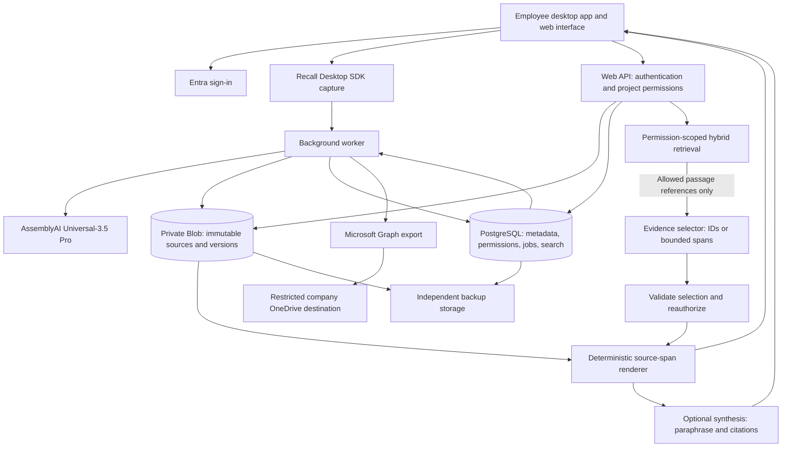
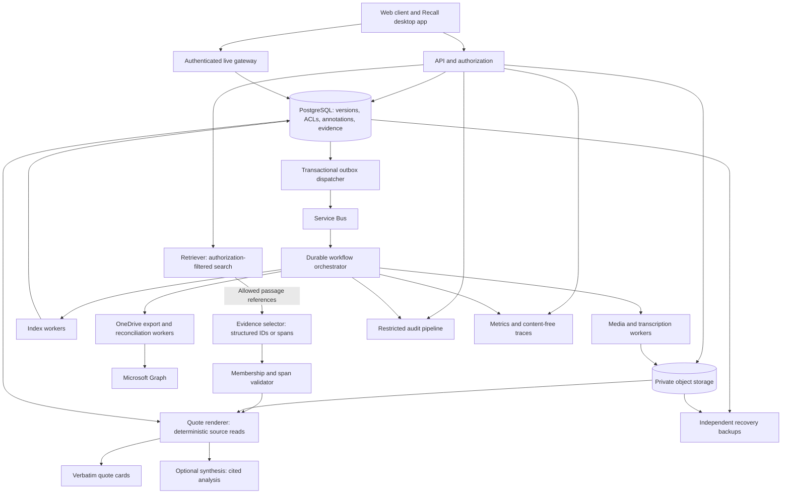

# Secure Transcript Intelligence

## Engineering specification and implementation plan

**Version:** 1.2  
**Date:** 16 September 2026  
**Audience:** Software engineering, IT/security, product owner, and operations  
**Status:** Implementation baseline; deployment-specific decisions in §19 must be recorded before confidential-data launch.

**Reading guide:** Product scope and targets (§1–3); stack and architectures (§4–6); modules, schema, and quote contracts (§7–10); connectors and security (§11–12); reliability, governance, and tests (§13–15); delivery and operations (§16–20).

## 1. Executive decision

Build an internal, single-company application that records or imports interviews, preserves raw audio and raw transcription output, prepares a cleaned/corrected version, explicitly approves it, and publishes immutable evidence. Implement three separate systems: **Retriever → Evidence selector → Quote renderer**, followed by optional synthesis. They may run in one deployment, but must have separate contracts, permissions, modules, and tests.

> **AI chooses where to look. Code determines what the source actually says.**

**Hard architectural constraint:** the LLM may generate analysis, but it may not generate user-visible quotations. Every quotation must originate from an authorized stored source span, rendered by deterministic application code. Enforce this in schemas, backend validation, and UI/export component boundaries, not only in prompts. A cleanup model's proposal is never evidence until it has passed the approval and publication workflow.

Deliver two stages using the same contracts and database:

1. **MVP:** Recall desktop recorder and uploads, AssemblyAI post-meeting transcription, private storage with independent backups, company-only login, explicit project membership, hybrid search, verified quote cards, and outbound OneDrive for Business export.
2. **Production:** Reliable multi-user operations, live bookmarks and notes, foreground and system-wide hotkeys, speaker diarization and review, collaboration, granular permissions, durable orchestration, audited governance, retention, and monitored recovery.

This is a proposed architecture inspired by the retrieval-and-rendering pattern in the supplied conversation. It is not a claim about Junior.ai's proprietary implementation. The retrieved conversation contained truncated architectural excerpts; this document resolves missing implementation details explicitly rather than assuming them.

### 1.1 The accuracy promise

**Ground truth is the approved transcript version plus its original-audio timestamp/provenance, when audio exists. “Verified quote” means exact equality to a contiguous span of that immutable, approved version.** Raw STT output and readable cleanup are separate retained artifacts. A model's cleaned output is not silently promoted to authority.

Approval does not imply that someone listened to every word. To preserve the earlier decision to defer audio verification, the initial project policy may automatically approve only deterministic, allowlisted formatting changes under §8.5, recording `approval_method=controlled_cleanup_policy` and the policy version. Human wording corrections require an authorized approver. Projects can instead require manual approval for every version. Human audio review remains optional and is separately labeled; an audio timestamp enables inspection but does not prove speech accuracy.

Transcript-only imports can be approved with `audio_provenance=unavailable`; never invent timing. If source audio later expires under retention policy, retain the approved text's quote guarantee and show that replay is no longer available.

The product must distinguish these labels:

| Label | Meaning |
|---|---|
| Verbatim from approved transcript vN | Deterministic source-span equality and approval status were checked at rendering time. |
| Raw transcript | Immutable original STT output or imported text; retained for provenance. |
| Cleaned/readable draft | Derived version; unavailable to normal evidence search until approved and published. |
| Approved by policy / approved by person | Explicit approval method and version; does not imply audio review. |
| Cleanup skipped | Parsed input remains unchanged and still passes through the configured approval policy. |
| Imported transcript | Source provenance; audio is optional and not required for verification. |
| AI analysis | Generated interpretation with references; not a verified quotation. |

The quote badge certifies fidelity to the saved transcript. It does not certify generated analysis or the truth of a speaker's statement. Do not claim that a cleanup prompt alone guarantees preservation of meaning; enforce the limited transformation contract in §8.5.

## 2. Goals, scope, and success criteria

### 2.1 Goals

- Capture usable meeting audio and retain its provenance.
- Make transcript evidence easy to find with exact phrases, filters, and natural-language questions.
- Eliminate model-authored wording from the quote-rendering path.
- Restrict all content to authorized employees and their permitted projects.
- Retain an authoritative copy independently of OneDrive and make exports predictable and auditable.
- Preserve timestamps and speaker context so employees can replay and review evidence.
- Add collaboration without rewriting ingestion, identity, or evidence contracts.

### 2.2 Non-goals

- Reproducing Junior.ai's proprietary services or interface.
- Guaranteed perfect speech recognition, guaranteed exhaustive semantic search, or automatically truthful synthesis.
- Meeting bots, calendar auto-join, telephony integration, video recording, PDF/OCR ingestion, external client portals, or public sharing in the initial releases.
- Voice biometrics or identification of real people from their voice. Diarization uses anonymous labels until a human maps them.
- Bidirectional editing with OneDrive. OneDrive is a managed export destination, not the source of truth.
- Sending email or chat messages on behalf of users, autonomous external actions, or training models on company recordings.

### 2.3 Proposed acceptance targets

These are product acceptance targets, not provider SLAs. Measure on the agreed pilot corpus and reference deployment; revise only through a recorded product decision.

| Area | MVP gate | Production gate |
|---|---|---|
| Quote fidelity | 100% exact source-span equality across deterministic, Unicode, and adversarial tests; no bypass path | Same invariant across UI, exports, saved answers, and APIs |
| Isolation | Zero unauthorized disclosures in the access-control suite, including counts and snippets | Same plus revocation, live sockets, caches, concurrent jobs, and recovery tests |
| Transcript cleanup | 100% of published cleanup edits pass the permitted-edit validator; prohibited changes fall back to unchanged input | Same, including model upgrades and multi-segment processing; no audio comparison gate |
| Diarization | Optional anonymous labels; unknown allowed | Anonymous labels and timing survive cleanup; human mapping available without mandatory audio review |
| Retrieval | Recall@20 ≥90% on ≥100 labeled questions with known permitted evidence; exact known phrase found in 100% of healthy indexed fixtures | Same on ≥500 questions and representative permission distributions |
| Abstention | All curated unsupported/adversarial cases show no invented quote | Same; quantify false negatives rather than promising exhaustive answers |
| Latency | p95 search ≤3 s, quote rendering ≤1 s, answers ≤15 s | Same at 50 simultaneous active users; report provider delays separately |
| Processing | p95 searchable within 30 min after a 60-minute upload under pilot load | Same at agreed steady ingestion load; queue delay visible |
| Capture | No silent missing audio; every gap or incomplete upload visible | Two-hour capture and reconnect tests; acknowledged chunks survive worker/client restarts |
| Notes/bookmarks | Schema reserved | p95 save acknowledgement ≤1 s online; timestamp alignment within ±1 s on test media |
| OneDrive | p95 export ≤5 min after publication when Graph is healthy | Same plus drift reconciliation and access revocation tests |
| Availability | Internal pilot target 99.5% monthly | 99.9% monthly for app reads/search; track provider-dependent processing separately |
| Recovery | RPO ≤24 h, RTO ≤8 h, demonstrated restore | RPO ≤1 h, RTO ≤4 h, quarterly demonstrated restore |

The “100%” quote requirement is an application invariant enforced on every response against the published transcript. Runtime failures must suppress the quote. Speech recognition quality benchmarking against audio may be added later; it is not a current acceptance requirement.

**Sizing assumptions:** MVP 10 employees, 5 active users, 100 audio hours/month. Production initially 100 employees, 50 active users, 20 concurrent recordings, 1,000 audio hours/month, and up to 1 million indexed passages. Load-test these assumptions before capacity commitments.

## 3. Functional requirements

M = MVP required; P = production required. Production includes every MVP requirement.

| ID | Stage | Requirement and observable behavior |
|---|---|---|
| FR-01 | M | Employee signs in through the firm's Entra tenant; only explicitly enabled, assigned employees can enter. |
| FR-02 | M | Users see and search only projects they belong to. Owners manage project membership. |
| FR-03 | M | Create a meeting with title, project, meeting date, language, participants, and recorded consent acknowledgement. |
| FR-04 | M | Record a supported microphone/audio source with level meter, elapsed time, start/pause/resume/stop, and clear upload status. |
| FR-05 | M | Upload WAV, MP3, M4A, or WebM audio; UTF-8 TXT, VTT, SRT, or the documented transcript JSON format. Validate actual content. |
| FR-06 | M | Initial limits: 2 GiB/audio file, 4 hours/meeting, 20 MiB/transcript file. Enforce before and after decoding; configuration can tighten these limits. |
| FR-07 | M | Show ingestion, transcription, cleanup, indexing, and export progress separately; retry recoverable failures without duplicates. |
| FR-08 | M | View transcript, search exact phrases or natural language, filter by date/meeting/speaker, replay timestamped audio, and copy verified quote cards. |
| FR-09 | M | Correct a transcript by publishing a new immutable version; existing citations remain pinned to their original version. |
| FR-10 | M | Generate optional evidence-backed analysis; return a clear no-evidence result or service error as appropriate. |
| FR-11 | M | Export each published transcript version to the configured company OneDrive for Business destination; show pending/success/error. |
| FR-12 | M | Record minimal security audit events for login, access denial, membership changes, publication, quote rendering, export, and deletion. |
| FR-13 | P | Press a configurable hotkey or button during recording to bookmark the current audio position. Jump between bookmarks afterward. |
| FR-14 | P | Create timestamped notes live, with an anchor fixed when the note starts; display beside the corresponding transcript and permit deliberate repositioning. |
| FR-15 | P | Distinguish speakers automatically, allow human mapping/correction, retain unknown/overlap labels, and preserve revision history. |
| FR-16 | P | Support shared/private annotations, shared saved evidence collections, threaded replies, presence, and optimistic concurrent editing. |
| FR-17 | P | Enforce per-transcript restrictions, export rights, retention policies, holds, access reviews, and complete audit reporting. |
| FR-18 | P | Recover jobs and capture sessions, monitor queues and provider health, and perform tested restores and reconciliation. |
| FR-19 | M | Preserve immutable raw transcription and separate cleaned/corrected drafts. Approve a specific content hash by controlled policy or authorized person before publication; no mandatory audio review. |
| FR-20 | M | Implement Retriever, Evidence selector, and Quote renderer as distinct modules/contracts; only the renderer can create quote text in user-visible responses or exports. |
| FR-21 | M | Show citation → quote → source span → approved version → audio timestamp provenance, with explicit unavailable/approximate states and permission checks on replay. |

### 3.1 Required screens

Project/meeting list; recorder/import dialog; processing status; transcript with audio player and annotation rail; search/answer with quote cards; version/history view; project membership settings; export status; production governance/audit console. Empty, loading, partial, forbidden, offline, and failed states must be designed for each applicable screen. Support keyboard navigation, visible focus, accessible names, and non-color-only status indicators.

## 4. Recommended stack and design decisions

Use a modular monolith initially. A module boundary is a code and authorization boundary; it does not require a separate service.

| Concern | MVP selection | Production evolution |
|---|---|---|
| Web UI | React + TypeScript, Vite build served by the web/API deployment | Same UI with live annotation updates |
| API | Python FastAPI, Pydantic contracts, SQLAlchemy/Alembic | Scale stateless replicas independently |
| Background processing | Python worker with durable PostgreSQL job table, leases, retry schedule, and transactional outbox | Azure Durable Functions orchestrator dispatching Python activities; Service Bus for external work/events |
| Hosting | Budget profile: one small DigitalOcean VM for app, API, and worker | Managed alternative: Azure Container Apps with separate worker pools |
| Database/search | PostgreSQL with full-text search and pgvector on the budget VM | Managed PostgreSQL when capacity/availability justify it |
| Authoritative files | Private Backblaze B2 for originals, transcript versions, and independently protected backups | Private Azure Blob Storage is the managed deployment alternative |
| Identity | Single-tenant Microsoft Entra ID; authorization-code flow with PKCE and server-side session | Same with managed employee lifecycle and access reviews |
| Meeting capture | Electron + Recall.ai Desktop Recording SDK | Same capture adapter with tested recovery and signed updates |
| Speech recognition | AssemblyAI Universal-3.5 Pro post-meeting transcription, pinned `universal-3-5-pro`, with diarization | Same, plus versioned speaker reconciliation and human correction |
| Transcript cleanup | Approved GPT adapter proposing narrowly permitted formatting edits; deterministic validation before publication | Same contract with versioned prompts and regression tests |
| Model use | Approved GPT deployment through an adapter for identifier selection and optional synthesis; approved embedding deployment | Pin model/configuration versions; evaluate before upgrades |
| Microsoft 365 | Microsoft Graph, service-owned export identity, fixed allowlisted destination | Reconciliation, stricter mappings, and enterprise audit integration |
| Secrets | Restricted server-side secrets, encrypted backups, no provider keys in desktop app | Managed vault and separate identities per workload/environment |
| Monitoring | Structured metadata logs and basic health checks | OpenTelemetry traces, dashboards, alerts, SLO reports |
| Delivery | Container builds, infrastructure as code, automated migrations and tests | Staged rollouts, rollback drills, supply-chain checks |
| System-wide hotkeys | Not in MVP | Signed Windows desktop companion; browser foreground shortcut remains available |

Pin supported language/runtime, dependency, provider API, and model versions in the repository at implementation. Do not adopt an unversioned “latest” model. Benchmark candidate deployments on the firm's corpus; record approved region, retention settings, embedding dimensions, and model identifiers in configuration. Check Azure extension and regional service availability during the foundation phase.

The budget profile uses an approved direct OpenAI API connector for cleanup/selection/synthesis and embeddings; an approved Azure-hosted deployment remains an alternative. Neither is required for deterministic keyword search and quote rendering. The three evidence systems remain separate code modules even when hosted on one VM. An under-$100 monthly target is conditional on usage, existing Microsoft licenses, and firm-approved providers; it is not a guarantee or the availability commitment of the managed production profile.

The selected ingestion pipeline is **Recall Desktop SDK → independently stored original audio → AssemblyAI Universal-3.5 Pro + diarization → speaker reconciliation → cleaned/corrected draft → approval → immutable canonical transcript**. Recall participant/activity metadata and AssemblyAI anonymous labels are reconciled by application code using aligned timestamps; ambiguous matches remain unnamed. Do not treat meeting display names as verified cross-meeting identities. Use Recall for capture without enabling a second transcription service. [Recall Desktop SDK](https://docs.recall.ai/docs/desktop-sdk), [AssemblyAI model documentation](https://www.assemblyai.com/blog/universal-3-5-pro-code-switching-contextual-prompting)

## 5. Architecture A — minimum viable application



Deploy one API and one worker from one repository, one database, one authoritative object store, and a separate backup location. Queued jobs survive restarts. No Redis, Kubernetes, dedicated vector database, event streaming platform, or meeting bot is required.

The Retriever, Evidence selector, and Quote renderer are separate tested modules. The renderer has no model dependency. API handlers cannot construct a quote from model output. The same renderer serves search cards, copied evidence, exports of quotes, and saved answers. Optional synthesis consumes successfully rendered evidence only.

### 5.1 MVP end-to-end flows

**Recording/upload → publication**

1. Authenticate and authorize project write access. Create meeting and upload/capture session.
2. Accept bounded chunks or uploaded file into quarantine; validate checksums, MIME signature, duration, malware status, and parser limits.
3. Commit raw file hash and immutable object reference. Store input provenance and consent metadata.
4. For audio: submit a transcription job through the approved provider adapter, poll with a durable schedule, retrieve output, then remove provider-side job artifacts according to policy. For text: parse deterministically and preserve original bytes.
5. Preserve immutable raw provider output and parsed transcript; create a separate cleaned/corrected draft under §8.5. Approve its exact content hash under the project policy, then freeze it as the canonical source. Compute passage spans and audio mappings from those exact bytes. Audio comparison is optional.
6. Build full-text and embedding indexes for the new version. Mark their independent readiness.
7. Atomically publish the version and active pointer only if approval matches the exact content hash and required indexes are ready. A lexical-only degraded release must be explicit and labeled.
8. Enqueue OneDrive export via the same committed outbox transaction. The app remains usable during export failure.

**Question → evidence**

1. Verify user and project/transcript access. Apply filters inside retrieval queries.
2. Retrieve ranked passage references using keyword and semantic retrieval.
3. Create a short-lived candidate set. A trusted evidence loader reads permitted candidate text for the selector; retrieval itself never generates quotation text.
4. Evidence selector returns only allowed passage identifiers or bounded span coordinates. Validate membership, scope, version, and range; do not accept quote wording.
5. Reauthorize each selected passage against current state. Renderer fetches pinned canonical text, checks hashes and bounds, and creates quote cards.
6. Optionally synthesize analysis from approved evidence, validate citation identifiers, label generated text, and present alongside independent quote cards.

## 6. Architecture B — robust multi-user production



Keep evidence, membership, and version metadata transactionally consistent in PostgreSQL. Do not split these into separate databases merely to create microservices. Scale media processing separately because decoding/transcription have different resource needs.

Durable Functions is the proposed workflow coordinator; its activities perform side effects and orchestrator state contains identifiers only. Durable state/replay must not contain raw transcripts, tokens, signed URLs, or audio. [Microsoft Durable Functions overview](https://learn.microsoft.com/en-us/azure/durable-task/durable-functions/durable-functions-overview)

### 6.1 Capture, hotkeys, and timestamp semantics

- Primary capture is the Recall Desktop SDK inside the employee's Electron app, on its tested platform matrix. Browser microphone recording is an optional fallback; it does not guarantee remote participants are audible.
- Before recording, show source names, separate level meters when possible, a short playback test, and an explicit capture-mode acknowledgement. If remote audio cannot be captured, guide the user to upload the meeting platform's recording.
- Browser display-audio availability varies by browser and source; the implementation must check actual returned audio tracks. [MDN display capture documentation](https://developer.mozilla.org/en-US/docs/Web/API/MediaDevices/getDisplayMedia)
- Use a monotonic capture timeline, not server receipt time. Store `capture_session_id`, segment ID, sequence, monotonic offset, media start/end milliseconds, device track, and pause/gap mappings.
- Recall owns its SDK upload lifecycle. On authenticated upload-completion notification, retrieve the recording, copy the original artifact into independent private storage, verify its hash/duration, and only then submit to AssemblyAI. Persist metadata/activity events with the capture timeline. For optional custom uploads/browser capture, use approximately 5-second chunks and ordered container reassembly; do not impose that chunking API on the Recall SDK.
- Acknowledgement means the chunk and hash are durable. Retry the same `(session_id, sequence)` idempotently. A conflicting hash is an error.
- Pause excludes paused time from the media timeline; preserve wall-clock start/end separately. Never concatenate around missing media without a visible gap mapping. Bookmark anchors in gaps remain marked unresolved.
- Browser hotkey default: configurable `Alt+Shift+B`, active only in the recorder context, suppressed in editable fields unless explicitly enabled. Button fallback is mandatory. Debounce repeated keydown events.
- Production system-wide hotkey uses a signed Windows companion because a background web page cannot reliably provide OS-wide shortcuts. Companion authenticates as the employee, binds to a visible active capture session, registers a configurable shortcut, and displays success/failure. It must not log general keystrokes.
- Capture time is fixed at hotkey press or note-start, not eventual submission. Notes support a user-adjustable anchor and record original and revised anchors. Default bookmark playback starts 5 seconds before its anchor, clamped to zero.
- For collaborators, the recorder owns the media clock. Other clients map their clock to recorder/server synchronization samples, record uncertainty, and offer correction. Flag uncertainty greater than 1 second.
- On disconnect, show recording interruption and pending note/bookmark state with client-generated idempotency IDs. Do not promise offline recording through Recall. Encrypted annotation/custom-upload buffering is permitted only on managed devices under an explicit policy. Clear buffers after durable acknowledgement or policy expiry. Recovery is best effort and must reflect the actual SDK's supported behavior. [Recall SDK limitations](https://docs.recall.ai/docs/desktop-recording-sdk-faq)
- Prevent system sleep during recording where supported; warn on track-ended, device removal, silence, quota exhaustion, session expiry, or stalled uploads. Never indicate “saved” for unacknowledged data.

Live bookmarks and notes do not depend on live transcription: they bind to the audio timeline and attach to the finalized transcript afterward. If live text preview is implemented, label it provisional, keep it outside the verified-quote index, and reconcile it to a new finalized version. Do not preserve provisional word offsets as if they were final evidence.

### 6.2 Collaboration

Annotations have author, visibility (`private` or `project`), anchor, revision number, and optional thread parent. Private notes are readable only by their author; they are excluded from shared search, synthesis, and exports. Changing to shared is an explicit action. Project members can see shared notes only while authorized for the transcript.

Use WebSocket/SSE messages for invalidation and status updates, then fetch authorized records. Authorize the subscription and each broadcast. Disconnect on revoked access; never broadcast full project content to a tenant-wide channel. Presence is ephemeral, best effort, and excludes note contents.

Use optimistic locking with `If-Match`/revision values. Conflicts return 409 with a permitted current version; never silently overwrite someone else's transcript correction or note. Shared collections store pinned quote references, not independent editable copies of quote text. Every read reauthorizes their underlying sources.

## 7. Modules, interfaces, and ownership

| Module | Inputs | Outputs / responsibility |
|---|---|---|
| Identity/session | Entra authentication result | Server session, verified tenant and employee identity |
| Authorization | User, action, project, optional transcript | Allow/deny; applied at API, database, jobs, live delivery, and rendering |
| Capture/upload | Metadata and bounded binary chunks | Validated raw asset, manifest, durable acknowledgements |
| Import parser | Raw text/VTT/SRT/JSON bytes | Canonical text plus provenance and optional timing; parser version |
| Speech adapter | Approved audio derivative, locale, options | Raw provider result, phrases/words, anonymous speakers, timing, quality metadata |
| Transcript cleanup | Parsed transcript and immutable segment IDs | Validated cleaned draft, source mapping, cleanup provenance; unchanged input on failure, still subject to approval |
| Transcript approval | Frozen draft hash, policy or authorized reviewer | Hash-bound approval/revocation decision; no audio-review implication |
| Version publisher | Canonical draft and parent version | Immutable version, passage IDs, active pointer update |
| Indexer | Versioned passages | Lexical records and embeddings tagged with model/index generation |
| Retriever | Principal, authorized scope, query, filters | Ranked allowed passage IDs, scores, and authorized metadata; no quote text |
| Evidence loader | Principal and sealed candidate set | Permission-checked candidate text for selector context only; not a user-visible quote |
| Evidence selector | Query, candidate references, loaded candidate context | Structured passage IDs or bounded subspans; no wording or authority to expand scope |
| Quote renderer | Principal, validated selection, pinned source spans | Reauthorized source-equal quote cards or typed error; no LLM dependency |
| Analysis composer | Query and rendered evidence | Generated claims with validated citation IDs |
| Annotation service | Actor, timestamp, note/bookmark | Revisioned annotation and authorized update event |
| Export connector | Published version, export policy, destination | Graph item references, hashes, status, reconciliation results |
| Governance | Retention/hold rules, deletion requests | Tombstones, purge jobs, audit events, completion report |
| Operations | Job state, metadata metrics | Retry/dead-letter handling, alerts, recovery evidence |

No user-provided prompt can invoke arbitrary storage, Graph, network, or administrative tools. Treat transcript content as untrusted data, including instructions embedded in interviews.

## 8. Data model and canonical source contract

### 8.1 Conventions

Use UUID identifiers, UTC `timestamptz` metadata, and integer millisecond audio offsets. `organization_id` is the domain name for existing `tenant_id`; `document_id` identifies the meeting transcript document (existing `meeting_id`). Use these mappings consistently, not competing identifiers. Add `workspace_id` with one default workspace per organization initially.

Every searchable passage, index record, candidate, and selected span carries `tenant_id`, `workspace_id`, `project_id`, `document_id`, `transcript_version_id`, and `passage_id`, directly or through enforced composite foreign keys. Other project-owned rows carry the same parent scope. Composite constraints prevent references across organizations/workspaces/projects. Never trust scope fields supplied by a caller; derive and validate them from authenticated identity and current membership.

Canonical text is an explicitly approved transcript version, encoded as UTF-8 without BOM with LF line endings. Preserve original audio, raw provider response, parsed raw text, and each cleaned/corrected draft independently. Apply permitted cleanup or authorized corrections, bind approval to the resulting content hash, then publish. No text transformations may occur after approval without invalidating it and creating a new candidate version. Quote cards identify the approved canonical version, not an interchangeable raw/cleaned representation.

Passage offsets use **zero-based UTF-8 byte offsets, start inclusive/end exclusive**. Validate UTF-8 character boundaries. Store byte lengths and SHA-256 hashes for canonical objects and each span. Browser UTF-16 string indices must never be used as source offsets. Render decoded text using escaped text nodes and `white-space: pre-wrap`; add highlights as visual wrappers without modifying characters. Copy actions use the verified string. A hash detects inconsistency; access control and protected storage provide resistance to malicious replacement.

### 8.2 Logical schema

This table defines required entities and constraints. Engineering must implement migrations, indexes, foreign keys, row policies, and generated OpenAPI types from it.

| Table | Essential fields and constraints |
|---|---|
| `tenants` | `id`, Entra tenant ID unique, policy/config reference, region |
| `workspaces` | id, tenant, name; one default initially; project foreign keys enforce parent workspace |
| `users` | `id`, tenant, Entra object ID unique within tenant, display name, email display value, enabled, authorization epoch |
| `projects` | `id`, tenant/workspace, name, owner, retention policy, transcript approval policy, authorization epoch, state |
| `project_memberships` | tenant/project/user, role, enabled; unique project/user |
| `meetings` | id, tenant/project, title, meeting date, creator, locale, consent acknowledgement, state, active transcript version ID |
| `capture_sessions` | id, meeting, actor, capture mode, started/stopped UTC, state, timeline manifest reference |
| `capture_chunks` | session, sequence unique, immutable blob reference, SHA-256, bytes, media offsets, durable acknowledgement time |
| `source_assets` | id, meeting, kind, original name, detected MIME, blob/version reference, SHA-256, duration, provenance, quarantine state |
| `raw_transcripts` | id, meeting, source audio asset ID nullable, raw provider JSON blob/hash, parsed text blob/hash, provider/model/config, created_at; append-only until policy deletion |
| `transcript_versions` | id, meeting, version number unique per meeting, parent ID, raw_transcript_id, canonical blob/version, SHA-256, byte length, cleanup model/prompt/validator versions, cleanup status, edit/correction manifest, status, approval_id, audio mapping reference, created_by/at, published_at, deleted_at |
| `transcript_approvals` | id, version ID, approved content SHA-256, method (`controlled_cleanup_policy` or `human`), policy version, approver service/user, timestamp, reason, optional audio-review scope; append-only decision records with separate revocation event |
| `speakers` | id, transcript version, anonymous label, display label, mapping origin/reviewer; version-scoped |
| `passages` | id, transcript version, ordinal, start/end byte, span hash, optional speaker and start/end ms, timing precision, review status; immutable after publish |
| `word_alignments` | version, ordinal, byte offsets, optional start/end ms, confidence if supplied; nullable/absent for untimed imports |
| `passage_indexes` | passage ID, search text/tsvector, embedding, model ID, dimension, generation, ready status; unique passage/model/generation |
| `transcript_acl` | production: meeting/user or approved group, explicit grant/restriction; effective access remains a subset of project membership |
| `annotations` | id, meeting, author, type, visibility, media anchor, optional pinned version/passage, body for notes, client event ID unique per actor, revision, timestamps, deleted_at |
| `annotation_revisions` | annotation ID, revision unique, previous/new content references, editor, edit time; same visibility as annotation |
| `evidence_runs` | id, principal, project, query hash, encrypted query optional, authorization epoch, index generations, expiry |
| `evidence_candidates` | run ID, candidate ID unique in run, passage ID, version ID, rank, score; scope fixed server-side |
| `source_spans` | id, passage/version IDs, absolute start/end byte, span SHA-256, audio asset/offsets nullable, alignment precision, origin run/selection, created_at; issued only by deterministic code and immutable |
| `saved_answers` | id, project, creator, optional generated body, cited pinned source-span IDs, model/prompt versions; reauthorize/revalidate approval on read |
| `quote_collections` | id, project, creator, title, revision; `collection_items` store pinned source-span references with source version, never editable quote copies |
| `jobs` | id, type, aggregate/version, idempotency key unique, status, attempt, lease_until, next_attempt_at, provider_job_id, safe error code |
| `outbox_events` | id, aggregate ID, event type/schema version, payload of IDs, created_at, dispatched_at |
| `export_destinations` | id, project, allowlisted drive/folder IDs, credential reference, verified ACL fingerprint, enabled |
| `export_manifests` | version/destination/format unique, blob/hash, Graph item ID, ETag, status, attempts, last reconciliation |
| `audit_events` | id, UTC time, actor/service, action, resource IDs, outcome, request/trace ID, authorization version; append-only |
| `retention_policies` / `holds` | policy durations per data class; hold scope, reason reference, authorized setter, state |
| `deletion_requests` | scope, requester, state, per-system completion, hold disposition, backup-expiry deadline |

### 8.3 Passage construction and version changes

Default passages follow speaker turns, split at deterministic sentence boundaries where possible, targeting 100–300 tokens and capping at 500. A long sentence can use a UTF-8-safe deterministic boundary. Short turns remain valid. Retrieval may index overlapping context windows, but renderable passages are fixed source spans and each card identifies its precise speaker scope. Q&A collections reference multiple distinct passages; they never manufacture joined quote text.

Publication writes a new blob and new passage IDs. In one transaction, verify a current approval for the exact blob hash and required index readiness, set the version published, update the meeting's active pointer with compare-and-swap against its expected parent, and append an outbox event. Concurrent publication conflicts return 409. Approval of v1 cannot authorize v2, even if only one number changed. Approval revocation immediately makes the affected version non-renderable and removes it from eligible retrieval; immutable bytes and decision history remain under retention policy.

Search defaults to active approved published versions. Historical versions require an explicit filter, retained approval, and current access. Old citations display their original version plus a superseded notice. Corrections never mutate those citations. If approval is revoked or retention deletes an old version, its quote becomes unavailable rather than silently rebinding to new text.

Human audio review is optional; transcript approval is required. For example, changing “fifteen million” to “fifty million” is a wording correction that creates a new version, correction rationale, and human approval. Preserve the raw STT result and audio anchor so a user can investigate the difference. Do not present the older and newer wordings as equivalent quotes. Redaction publishes a replacement version and restricts the unredacted version; simply hiding it from default search is insufficient.

### 8.4 Transcript JSON import contract

```json
{
  "schema_version": 1,
  "language": "en-US",
  "segments": [
    {
      "text": "We expect the project to start in October.",
      "speaker_label": "Speaker 1",
      "start_ms": 12500,
      "end_ms": 16400
    }
  ]
}
```

Require a nonempty `segments` array and nonempty text in each segment. `speaker_label`, `start_ms`, and `end_ms` may be null; times must be supplied together and satisfy `0 <= start_ms <= end_ms`. Array order defines transcript order; overlapping times are permitted and identified as overlap. Reject unknown schema versions and unsupported fields. Parsed text joins segment text with exactly one LF; speaker labels and times remain metadata. Preserve whitespace inside input text before the cleanup stage. Canonical byte offsets are computed after validated cleanup, never accepted from the upload. A separately attached audio asset is associated through an authorized meeting action; imports cannot reference arbitrary local paths or remote URLs.

### 8.5 Conservative LLM cleanup and ground-truth publication

**Purpose:** improve layout/readability without changing actual phrasing or meaning. Run cleanup once during ingestion, before indexing and citation creation. It is separate from both evidence selection and quote rendering.

**Initial permitted edits:** leading/trailing horizontal whitespace, repeated spaces/tabs between existing tokens, and paragraph/line-break placement inside an existing speaker segment. Never join or split lexical tokens, change segment order, or move text between speakers. Preserve existing punctuation and case in this initial version: punctuation and capitalization can change meaning, and token equality alone cannot detect that. Broader cleanup may be introduced later through an explicit revised policy, not a silent prompt change.

**Prohibited edits:** adding, removing, reordering, or substituting words; paraphrasing; repairing grammar; removing fillers, repetitions, false starts, or hedges; correcting names/numbers; expanding contractions; translating; resolving ambiguity; or inventing missing speech. Preserve negations, qualifiers, units, dates, and speaker assignments exactly. Retain uncertainty markers supplied by the original transcription.

The cleanup model proposes a structured list of edits against stable segment IDs and pre-cleanup byte offsets, with expected original bytes and replacement text. The backend rejects overlapping/out-of-range edits, altered source bytes, and changes outside the allowlist. Apply accepted edits deterministically; verify that the sequence of all non-whitespace tokens, punctuation, case, and segment assignments is identical before and after. Preserve line/turn boundaries that the parser marks semantically significant. Such validation proves the restricted edit contract, not semantic equivalence for arbitrary rewriting.

If cleanup times out, returns invalid edits, or exceeds the policy, retain unchanged parsed text with `cleanup_status=skipped` and a safe reason code. The initial controlled policy may approve that unchanged content, recording the decision; a manual-approval project remains awaiting approval. Never silently accept a rewritten transcript. An employee can deliberately correct source wording through a new version with human approval; this is a source correction, not automatic cleanup.

Persist pre-cleanup text/hash, accepted edit manifest, model/prompt/validator versions, draft text/hash, approval decision, and segment/token mappings. Remap word-level byte offsets to the approved text while retaining original media timestamps. Human edits that cannot retain exact word alignment fall back to the original utterance interval with `timing_precision=approximate`; never fabricate precise word times. Compute passages and hashes only from frozen approved text. Search results, quote cards, and OneDrive exports use that version. Re-running cleanup creates a new version requiring a new approval.

The provenance chain is **answer citation → rendered source span → passage → approved version → raw transcript → original audio asset and timestamp**. Audio remains independently stored. Users may inspect authorized raw/draft artifacts in the history view, but those cannot enter normal evidence selection until approved. Source provenance survives absent or expired audio as an explicit availability state.

## 9. Retrieval and quote-safety specification

### 9.0 Three separate systems and their trust boundaries

| System | Input | Permitted output | Forbidden behavior |
|---|---|---|---|
| **Retriever** | Question and server-derived authorized scope | Sealed run containing allowed passage IDs, version/scope IDs, scores, and authorized source metadata | Generate quote text, expose unauthorized hits/counts, retrieve outside scope and filter only afterward |
| **Evidence selector** | Question plus candidate context supplied by the trusted evidence loader | Selected allowed passage IDs, optionally with strictly defined subspan offsets | Author quote text, invent attribution/timestamps, select an unreturned passage, write source records |
| **Quote renderer** | Principal, run, validated passage/span references | Exact stored source text and provenance, after reauthorization and integrity validation | Call an LLM, use index/model wording as source text, modify or stitch quoted words |

The evidence loader is trusted application plumbing: it reauthorizes and loads canonical text for the sealed candidates so the selector has evidence to assess. “Passage IDs only” describes the Retriever's output contract, not a requirement that the selector decide relevance without seeing text. Candidate text is untrusted prompt data and must never be treated as instructions.

Use separate modules `domain/retriever/`, `domain/evidence_selector/`, and `domain/quote_renderer/`. The retriever cannot import the quote renderer or generation client; the selector cannot mutate sources; the renderer cannot import or call model clients. Enforce dependency rules in CI. Only renderer code constructs the internal `VerifiedQuote` type. Public answer/search handlers orchestrate these modules and do not concatenate a model response into a quote.

Optional synthesis runs **after successful source rendering** and consumes those evidence objects. Independent access changes before delivery must invalidate both the affected quotes and any analysis derived from them.

### 9.1 Retrieval defaults

Construct the eligible set first from authenticated organization/workspace membership, project membership, document restrictions, active-version policy, retained approval, and source availability. Apply those predicates within both keyword and semantic queries before ranking/limiting. Within that set, retrieve up to 50 lexical and 50 vector candidates, combine with reciprocal-rank fusion, deduplicate passage IDs, and retain up to 20 candidates. Candidate expansion happens before sealing the set and requires the same access checks. The selector may choose up to 8 cards. Scores indicate retrieval relevance, never confidence in a speaker's claim.

MVP search is scoped to one project. Future cross-project search may use a server-derived allowlist of authorized projects, never user-supplied IDs alone. SQL RLS and scoped joins enforce the filter; a query plan must not rank globally with `LIMIT` and only then discard unauthorized hits. If an approximate-vector implementation cannot implement the required eligible set correctly, use exact ranking within the authorized set until a tested filtered index is available.

Exact phrase search uses a substring/phrase verification against canonical text after indexed candidate discovery. Normalized search text may improve matching, but never supplies rendered quotes. Approximate vector search must not lose all relevant results under selective permission filters: benchmark filtered recall, oversample as needed, and fall back to exact vector search within a small authorized set. Never retrieve globally and depend solely on UI filtering.

Calibrate relevance thresholds on the evaluation corpus; similarity scores are not probabilities of truth. Search and quote-only mode work without the selector by rendering the top permitted references directly. The selector is a relevance aid, not a security boundary.

### 9.2 Mandatory rules

1. The selector returns only allowed passage IDs and optional validated span offsets under §9.5. It returns no quote text, source paths, speaker names, or timestamps. Any unexpected field rejects the selection.
2. A candidate set is bound to a principal, authorized scope, query, immutable version IDs, and a 10-minute expiry. It is stored server-side; a caller cannot submit its own allowed set.
3. Reject unknown IDs, duplicates beyond schema limits, expired runs, altered scope, and invalid model JSON. One bounded repair attempt is permitted; then use deterministic results or return a selection error.
4. Renderer checks current user status, organization/workspace/project scope, transcript restrictions, source state, retained content-hash approval, and version availability for every card. Guessing a passage or span ID never grants read access.
5. Renderer reads the pinned source object, verifies canonical hash, verifies offset bounds and UTF-8 boundaries, slices exact bytes, checks span hash, and decodes strictly.
6. Only successful renderer output receives the verbatim badge. If any integrity check fails, fail that card closed and raise an integrity alert. Never substitute text from an index, cache, model response, or newer version.
7. At rendering time, no further cleanup, ellipses inside the verified text, merging disconnected spans, translation, or model shortening. Permitted ingestion cleanup is already frozen in the ground-truth version. Multiple excerpts are multiple cards. Human-selected subspans must pass the same deterministic bounds validation and create server-issued span references.
8. Attribution is trusted source metadata outside the quoted text. Unknown speaker/time remains unknown. Generated guesses cannot fill missing fields.
9. A visible audio link uses recorded alignment and identifies approximate timing. Untimed imports show line/passage location without invented timestamps.
10. Revalidate saved references on every display/export. Content caches are disabled initially; any later cache must be scoped by principal/access epoch/version and cannot bypass authorization or hash checks.
11. Model-generated prose is never passed into any quotation-bearing field or presentation, even if it resembles an exact quotation. Enforce the analysis-output policy in §9.4 across UI, API, copy, and export paths.
12. Audit successful and rejected rendering with identifiers and reason codes, excluding quote content from operational logs.

### 9.3 Normative pseudocode

```python
def render_quote(principal, run_id, candidate_id):
    run = load_run_for_principal(principal, run_id)
    require_not_expired(run)
    candidate = require_candidate_in_run(run, candidate_id)
    passage, version = load_pinned_records(candidate)
    authorize_current(principal, "read", version.meeting_id)
    require_renderable(version)  # approved hash, published, retained, not revoked
    source = read_exact_object_version(version.blob_ref)
    require(sha256(source) == version.sha256)
    require(0 <= passage.start_byte < passage.end_byte <= len(source))
    require_utf8_boundaries(source, passage.start_byte, passage.end_byte)
    span = source[passage.start_byte:passage.end_byte]
    require(sha256(span) == passage.sha256)
    text = span.decode("utf-8", errors="strict")
    authorize_current(principal, "read", version.meeting_id)  # before delivery
    require_current_approval(version.id, version.sha256)  # before delivery
    append_durable_render_audit(principal, passage.id, version.id)
    return QuoteCard(text=text, passage_id=passage.id,
                     transcript_version_id=version.id,
                     source_sha256=version.sha256,
                     start_byte=passage.start_byte, end_byte=passage.end_byte,
                     attribution=trusted_metadata(passage, version))
```

This example renders a whole passage. For a subspan, first perform the same full passage integrity checks, validate/translate offsets under §9.5, and use the resulting server-issued source span for slicing and output. Saved quotes use pinned server-issued span references with current permission/approval checks, not expired selection runs; selection expiry cannot authorize a new selection. For long transcripts, use a hash-verified immutable source cache in the trusted renderer process; never use an unverified range read as proof of whole-source integrity. Authorization remains per delivery. A revocation cannot recall bytes already delivered, but it must block subsequent requests and live messages.

### 9.4 Synthesis and failure semantics

Return a structured response with `status`, `analysis`, and `quote_cards` as separate fields. Analysis consists of claims with candidate citations. Validate that every citation maps to rendered evidence; exclude uncited factual claims or return evidence-only mode. A citation validates a reference, not logical entailment. Evaluate claim support separately and label all synthesis as AI analysis.

**No model-authored quotations:** synthesis returns plain paraphrase fields and source-span citation IDs, never Markdown/HTML or a quote field. Reject model text containing double-quotation delimiters (straight, curly, or guillemets), Markdown blockquotes/code fences, or markup proposing quotation presentation; preserve ordinary apostrophes within words. If a generated claim cannot meet this contract after one bounded retry, omit analysis and return verified evidence. Parse structured strings before checking them; JSON's structural quotation marks are not user-visible prose.

The UI treats analysis as escaped plain text, supplies citation links separately, and permits quotation styling only through `VerifiedQuote` components built from renderer output. Exporters enforce the same separation. Do not stream unchecked model text to the user. Do not remove quote marks from an invalid generated quote and relabel it as verified. Prompts request paraphrase only; deterministic validation and typed rendering enforce the actual quotation boundary. This prevents generated text being presented as a verified quotation, but does not prove the truth or support of every paraphrase.

If no permitted relevant evidence is found, return `no_evidence` with “No relevant evidence found in the transcripts you can access.” Do not assert the information does not exist anywhere. Provider outage is `service_unavailable`; incomplete indexing is `partial_index`; neither is a factual absence result. If evidence exists but synthesis fails, return verified cards with `analysis_unavailable`.

### 9.5 Concrete selection and response contracts

The retriever's internal response contains `run_id`, scope/index metadata, and `candidates`, for example:

```json
{
  "run_id": "R17",
  "candidates": [
    {
      "passage_id": "P184",
      "transcript_version_id": "V3",
      "document_id": "C27",
      "score": 0.91,
      "speaker_label": "Expert",
      "start_ms": 1902000
    }
  ]
}
```

Illustrative IDs above stand for UUIDs in production. Response metadata comes from authorized stored records; there is no quote/snippet text in this contract. A public search page gets cards by explicitly invoking the renderer after retrieval.

Default selector output is exactly `{"selected_passages":["P184","P201"]}` with zero to eight unique passage IDs from the run. Strict schema validation uses `additionalProperties: false` and server-side membership checks regardless of provider structured-output support.

Optional precise-excerpt mode uses a separately configured schema:

```json
{
  "selected_spans": [
    {"passage_id": "P184", "start_character": 418, "end_character": 563}
  ]
}
```

These offsets are **zero-based Unicode code-point positions within the exact, unnormalized passage text supplied to the selector**, start inclusive/end exclusive. They are not UTF-16 code units, UTF-8 bytes, or offsets into the entire transcript. Validate integer type, `0 <= start < end <= code_point_length`, allowed passage membership, pinned version, and permitted boundaries. Require deterministic sentence/word boundaries and do not split a grapheme cluster; reject rather than silently round invalid positions. Precomputed sentence/span IDs are preferable when model offset errors are frequent.

The server converts validated code-point positions to absolute UTF-8 byte offsets inside the pinned canonical source, slices exact bytes, computes a span hash, and issues a `source_span_id`. Reject disconnected ranges in one card; use multiple independently rendered cards. Do not allow the model to submit hashes, `source_span_id`, text, attribution, or versions. Invalid offsets produce a selection error or explicit whole-passage fallback, never a guessed excerpt. Freeze each run's selector schema version; default ID mode and span mode cannot be mixed.

The public response contains `run_id`, `status`, `index_health`, `analysis` (nullable), and `quote_cards`. Each card includes `source_span_id`, `candidate_id`, `passage_id`, `transcript_version_id`, `approval_id`, approval method, renderer-produced `text`, `source_sha256`, `span_sha256`, absolute byte offsets, source title, speaker label (nullable), original audio asset ID/offsets (nullable), audio availability, timing precision, and optional audio-review state. Analysis uses `{claims:[{text, citation_span_ids}]}`; every cited span must be in delivered cards. Span IDs uniquely distinguish multiple excerpts from one passage. These are application schemas independent of provider transport format.

## 10. Application API and events

All application endpoints are under `/api/v1`. Use server sessions with secure HttpOnly SameSite cookies, CSRF protection for mutations, strict CORS, and standard OAuth protections. API clients use explicitly scoped tokens if introduced later. Request/response bodies use documented schemas, bounded lengths, and UTC/offset conventions above.

| Method/path | Request | Response/behavior |
|---|---|---|
| `GET /me` | Session | Employee identity and permitted actions |
| `GET/POST /projects` | Filter / name | Accessible projects / new project |
| `PUT /projects/{id}/members/{userId}` | Role, expected revision | Owner-authorized membership change and epoch bump |
| `POST /projects/{id}/meetings` | Title, date, locale, consent metadata | Meeting ID |
| `POST /meetings/{id}/uploads` | Kind, name, byte count, checksum | Upload ID and restricted upload instructions |
| `PUT /uploads/{id}/chunks/{sequence}` | Bytes, hash, range | Durable acknowledgement or conflicting-hash error |
| `POST /uploads/{id}/complete` | Ordered manifest, total hash | 202 and ingestion job ID |
| `POST /meetings/{id}/capture-sessions` | Capture mode | Session ID and clock parameters |
| `POST /capture-sessions/{id}/finalize` | Manifest and gap map | 202 and processing state |
| `GET /jobs/{id}` | None | Permitted job progress, safe error, retryability |
| `GET /meetings/{id}/transcripts/{versionId}` | Pagination | Source passages, provenance, version/review state |
| `POST /meetings/{id}/transcript-versions` | Parent ID, corrected content | New version preparation job |
| `POST /transcript-versions/{id}/approve` | Expected content hash, approval rationale, optional review metadata | Authorized human approval; controlled-policy approval is service-only |
| `POST /transcript-versions/{id}/revoke-approval` | Expected approval ID, reason | Immediate evidence exclusion and audit; no source mutation |
| `POST /transcript-versions/{id}/publish` | Expected active parent and approval ID | Publish only if approval matches exact content hash, or 409 conflict |
| `GET /meetings/{id}/audio` | Range request, asset ID | Authorized streamed audio; no public blob URL |
| `POST /projects/{id}/search` | Query, filters, mode | Run ID, rendered search cards, index health |
| `POST /projects/{id}/retrieval-runs` | Question, filters | Authorized passage references and metadata only, no quote text |
| `POST /evidence-runs/{id}/select` | Selector mode | Validated selected passage IDs or server-issued span references; no quote text |
| `POST /projects/{id}/answers` | Query, filters, analysis flag | Status, optional cited analysis, deterministic quote cards |
| `POST /evidence-runs/{id}/quotes` | Selected passage IDs or validated span references | Renderer-produced revalidated quote cards; caller cannot supply text |
| `POST /meetings/{id}/annotations` | Client ID, type, anchor, body, visibility | Persisted annotation and revision |
| `PATCH /annotations/{id}` | Patch plus `If-Match` | Updated revision or 409 |
| `POST /projects/{id}/collections` | Title, pinned references | Collection ID; reauthorize every reference |
| `POST /transcript-versions/{id}/exports` | Configured destination ID | 202 and idempotent export ID |
| `GET /exports/{id}` | None | Export state and permitted destination link |
| `POST /meetings/{id}/deletion-requests` | Reason reference | Tombstone/purge workflow or hold-blocked state |
| `GET /projects/{id}/audit` | Bounded filters | Authorized metadata audit page |

Mutation idempotency keys are required for upload finalization, transcription submission, publication, export, and annotation creation. Scope keys to principal/action/resource and retain through the retry window. Same key with different payload returns 409. Use cursor pagination and enforce per-user/project quotas.

Error shape: `{code, message, request_id, retryable}`. Use 401 for unauthenticated, 404 for inaccessible resource identifiers, 409 for state conflicts, 413 for limits, 422 for invalid input, 429 with retry guidance, and 503 for unavailable dependencies. Do not leak raw provider messages, document names, or signed URLs.

### 10.1 Internal event envelope

```json
{
  "event_id": "uuid",
  "schema_version": 1,
  "type": "transcript.published",
  "tenant_id": "uuid",
  "project_id": "uuid",
  "aggregate_id": "uuid",
  "occurred_at": "2026-09-15T15:00:00Z",
  "trace_id": "opaque-id",
  "data": {"transcript_version_id": "uuid"}
}
```

Events: `upload.completed`, `source.validated`, `transcription.requested`, `transcription.completed`, `transcription.failed`, `transcript.draft_created`, `transcript.approved`, `transcript.approval_revoked`, `index.ready`, `transcript.published`, `annotation.created`, `annotation.updated`, `access.changed`, `export.requested`, `export.completed`, `export.failed`, `retention.due`, `deletion.completed`. All project events include `workspace_id`; document events carry `document_id` as well. Approval events identify the exact version/hash and decision record, without transcript text.

Events contain identifiers, not confidential bodies. Delivery is at least once. Consumers deduplicate by event ID and operation key, verify aggregate state, and reject stale work. Commit domain change and outbox event together; acknowledge queue messages only after durable progress. Define event ordering per aggregate rather than assuming global ordering.

## 11. OneDrive and provider connectors

### 11.1 OneDrive contract

“Sync” in this specification means **one-way versioned export**. Each published version exports a readable Markdown transcript, a TXT copy, and a JSON provenance manifest. Include shared notes/bookmarks only when the project export policy permits them; exclude private notes. Audio export is off by default. Quote exports use the same renderer.

Configure an allowlisted company OneDrive for Business `drive_id` and `folder_id` per project. For long-term ownership, IT may instead provision a SharePoint document library accessed through OneDrive; this is a documented destination choice, not a silent substitution for the requested OneDrive destination. Avoid dependence on an employee's personal account lifecycle.

Use deterministic folders such as `{project_uuid}/{meeting_uuid}/v{number}/transcript.md`; put human-readable titles inside the document. Files are immutable per version. Store destination item IDs, ETags, export hashes, and a manifest; export completion means all required files are present and verified. Export retries must not create duplicates or overwrite human edits.

Graph selected permissions require both the relevant consent and an explicit grant on the selected resource. Prove the chosen drive/folder and upload operations work with the proposed least-privilege grant in a test tenant; do not silently broaden to tenant-wide file access. [Microsoft selected permissions](https://learn.microsoft.com/en-us/graph/permissions-selected-overview)

Use Graph v1.0 drive-item upload operations and resumable upload sessions when appropriate. Persist progress securely, handle expiry, honor `Retry-After`, and use conditional/conflict handling. Upload-session URLs are secrets; never log them. Follow documented fragment alignment and sequencing requirements. [Microsoft Graph upload sessions](https://learn.microsoft.com/en-us/graph/api/driveitem-createuploadsession?view=graph-rest-1.0)

### 11.2 Export access control and drift

- Destination readers must be a subset of authorized project/transcript readers and enabled employees. Block export if destination ACLs cannot be verified or are broader than the source.
- MVP uses project-level destinations with identical project membership; prohibit transcript-specific export exceptions. Production either provisions matching narrower destinations or blocks those exports.
- Disable anonymous/external sharing through tenant policy and require managed devices for synchronized confidential content where the firm requires it.
- Membership removal revokes app access immediately and enqueues destination permission reconciliation. Pause affected exports until permissions are correct. Alert if synchronization cannot complete.
- Run daily reconciliation in MVP and at least every 15 minutes in production for destination availability/ACL drift, plus change-triggered checks. Inspect existing exports as well as future writes.
- External edits/deletions become `destination_drift`; never import them into canonical source automatically. Offer explicit re-export with conflict-safe naming or ingest as a new version through the ordinary upload path.
- App permissions cannot revoke already downloaded/offline copies. OneDrive access policy, managed-device controls, and firm retention procedures govern those copies; do not promise instantaneous recall.

### 11.3 Model and speech connector boundaries

Speech workers send only the audio required for the job to the approved service. Store provider IDs, API/model versions, settings, language, raw result, and timing provenance. Request timestamps when supported; missing confidence or timing remains null. Delete provider-side temporary artifacts after verified retrieval, with retryable cleanup tracking.

Selection and synthesis receive only permitted relevant passages, never unrestricted repository access. Embeddings are confidential derived data. Use local database search instead of provider-hosted vector stores for the baseline architecture.

For direct OpenAI API use, API data is not used for training by default, but retention depends on endpoints and account controls. `store=false` alone is not a zero-retention guarantee. Review abuse monitoring, application state, model exceptions, and approved retention controls before confidential traffic. [OpenAI data controls](https://developers.openai.com/api/docs/guides/your-data)

An Azure-hosted GPT deployment is a separate connector with its own contractual and regional review; do not apply direct OpenAI retention assumptions to it. No automatic fallback to a different provider, region, or consumer ChatGPT account. If the approved connector is unavailable, use lexical/evidence-only functionality where possible.

## 12. Security, confidentiality, and isolation

### 12.1 Authentication and authorization

Use a single-tenant Entra application, validate issuer/audience/signature/expiry/nonce, and require the firm's tenant ID. Tenant membership alone is insufficient: guests can belong to the tenant. Require enabled employee membership in an assigned enterprise application/group and an app user record. Email-domain matching is only an additional check; email is not the stable identity key. Use tenant ID plus Entra object ID. Single-tenant application behavior is documented by [Microsoft Entra](https://learn.microsoft.com/en-us/entra/identity-platform/single-and-multi-tenant-apps).

Require MFA through tenant policy. Idle session timeout is 30 minutes with an 8-hour absolute lifetime as an initial app default. Long recordings must warn and renew authentication before expiry; they do not bypass disabled-user checks. Recheck app authorization on every request. Employee deprovisioning must update the app allowlist promptly, target ≤5 minutes end to end, and have an emergency immediate-disable control.

| Role | Rights |
|---|---|
| Reader | Read/search/replay permitted transcripts; create personal notes and personal evidence collections |
| Contributor | Reader plus record/upload and shared annotations; prepare transcript corrections |
| Project owner | Contributor plus publish versions, manage project members and approved exports, request deletion |
| Tenant administrator | Configure identities/connectors/policies; no automatic transcript-read permission |
| Compliance auditor | Scoped audit metadata access; content access only through explicit separate assignment |

Production adds an explicit export capability and transcript restrictions. Effective transcript access is project membership intersected with transcript grants/restrictions; a transcript grant cannot admit someone outside the project. Services use action-specific identities. Administrative break-glass content access requires a time-limited assignment and durable audit.

Project owners may approve or revoke transcript versions; an explicit reviewer capability may delegate that permission. Contributors may propose corrections but cannot approve wording changes by themselves unless separately granted reviewer capability. The controlled-cleanup service may approve only unchanged text or validated edits under a recorded project policy; it cannot approve arbitrary human/model rewrites. Approval authorization is independent of permission to read audio or to claim audio review.

### 12.2 Database and object isolation

Enable and force PostgreSQL row-level security on organization/workspace/project content tables, including passages, indexes, drafts, approval decisions, candidates, and source spans. Runtime roles must not own tables, be superusers, or have `BYPASSRLS`; migration credentials are separate. Set validated principal/tenant/workspace context transaction-locally and clear it through connection-pool discipline. Apply permission-scoped predicates before both keyword and semantic ranking, recheck in the evidence loader before sending content to the model, and recheck at quote delivery and audio playback. Policies also cover joins, writes, annotations, saved answers, and audit access. PostgreSQL documents owner/superuser bypass behavior; test these cases explicitly. [PostgreSQL row security](https://www.postgresql.org/docs/current/ddl-rowsecurity.html)

Workers receive scoped service context and verify referenced resources before acting. RLS is defense in depth alongside application checks, not protection against a fully compromised database administrator. Do not concatenate user-controlled session settings or SQL.

Private object containers have no public access. Object keys alone grant no access. Serve reads through an authorized API, or a tightly bounded approved signed-read mechanism if introduced later; the baseline audio player uses authorized streaming. Upload tokens, if used, are short-lived, write-only, scoped to quarantine, and size-constrained by finalization validation. Never permit overwrite of published objects.

### 12.3 Required controls

- TLS in transit; managed encryption at rest for database, objects, backups, logs, and job state. Production evaluates customer-managed keys against firm policy.
- Separate dev/staging/production accounts/resources and identities; only synthetic or explicitly approved de-identified data outside production.
- Key Vault for secrets, rotation procedures, workload identity where supported, no provider secrets in browser bundles.
- Private database/storage networking where supported; explicit outbound allowlist for approved identity/provider/Graph endpoints. Test transcription access without making source storage public.
- Threat protection for uploads: quarantine, signature detection, sandboxed decoding, patched media tools, decompression/duration limits, and parser resource limits. No arbitrary URL imports in baseline.
- Input/output escaping, content security policy, dependency scanning, secure cookies, CSRF protection, rate limiting, and no third-party session replay or content analytics.
- No raw audio, transcripts, notes, full prompts, model responses, query text, access tokens, or signed URLs in application telemetry. Opt-in diagnostic content capture requires separate access and expiry policy.
- Backups use separate credentials and deletion permissions. Restores reapply authorization, tombstones, and retention before user traffic.
- Record recording-policy acknowledgement and make recording status visible. The firm supplies its consent policy and permitted jurisdictions; engineering does not infer consent from login.

### 12.4 Threat cases and defenses

| Threat | Required defense |
|---|---|
| Employee guesses another project's ID | API authorization, RLS, composite ownership constraints, non-disclosing 404 |
| Transcript instructs model to reveal secrets | Treat content as evidence only; no tools; ID allowlist and authorization |
| Model fabricates a passage or quote | Strict selection schema and deterministic renderer |
| Removed employee reuses cached answer/link | Current authorization on every read, no shared content cache, short sessions and live disconnect |
| Export broadens confidentiality | Verified destination ACLs, export capability, drift reconciliation |
| Malformed upload attacks parser | Quarantine, sandbox/resource limits, scanning and content validation |
| Worker processes stale deleted content | Tombstone/state check before each side effect and before publication |
| Operator or credential compromise | Least privilege, separate audit/backup administration, rotation and incident response |

## 13. Orchestration and failure behavior

Use separate state machines rather than one overloaded meeting status:

- Capture: `created → recording → finalizing → complete`, with `interrupted` and `aborted`.
- Ingestion: `quarantined → validated → transcribing/parsing → raw_saved → cleaning/correcting → draft_ready → awaiting_approval → approved → indexing → published`, with retryable failure, permanent failure, and cancelled states. Controlled-policy approval may complete immediately after draft validation but always writes a decision record. Rejected cleanup falls back to unchanged input and follows the same approval policy. Approval revocation makes any published version non-renderable until a fresh valid decision is recorded; publication and approval state are tracked separately.
- Export: `pending → uploading → verified`, with retryable failure, permission-blocked, drift, and deleted states.
- Deletion: `requested → tombstoned → purging → complete`, or `held`/`external_cleanup_pending`.

MVP jobs use database leases, heartbeat renewal, exponential backoff with jitter, a maximum attempt count (initially 8), and a dead-letter state with an operator retry action. Distinguish transient failures from validation/permission failures. A scheduler reclaims expired leases and reconciles jobs with provider state. Unknown provider submission outcomes must be reconciled before resubmission; exactly-once external execution is not assumed.

Production workflows persist step completion and identifiers. Side effects are idempotent, cancellation checks occur before each step, and deletion dominates late completion. Keep orchestration retries and activity retries bounded to avoid multiplying attempts or costs.

| Failure | User-visible behavior | Recovery |
|---|---|---|
| Device/microphone stops | Recording interrupted; last durable duration and missing interval visible | Resume as mapped segment or upload replacement |
| Network disconnect | Pending uploads/annotations clearly marked | Retry same chunk/event IDs; verify complete manifest |
| Corrupt/unsupported input | Actionable validation error; no fabricated transcript | Replace upload; quarantined asset expires |
| Speech provider timeout | Transcription delayed/failed; original retained | Reconcile provider job and bounded retry |
| Embedding failure | Lexical-only results if published in explicit degraded mode | Retry index generation; never mark semantic index healthy |
| Selector/synthesis outage | Verified search cards remain available | Evidence-only mode, explicit analysis status |
| Bad hash or missing source | Affected quote unavailable; integrity event | Quarantine version and restore verified source |
| Unapproved draft or revoked/mismatched approval | No searchable evidence or quote from that version | Authorized approval of the exact hash or new corrected version |
| Invalid model offsets or generated quotation prose | No generated quotation is displayed | Bounded selection retry/whole-passage fallback; evidence-only response if synthesis rejected |
| Missing or expired audio | Exact approved transcript quote remains available with replay-unavailable label | Preserve source identifiers; do not fabricate audio or timing |
| Graph throttling/outage | App transcript available; export pending | Backoff and resumable retry |
| Graph access revoked | Export permission-blocked | IT fixes destination grant; no permission broadening |
| Access revoked mid-answer | Recheck before delivery and suppress inaccessible evidence/analysis | Re-run under current scope or return access-changed status |
| Duplicate event/concurrent publish | Existing result or 409 | Idempotency and expected-parent check |
| Database unavailable | No success acknowledgements; save unavailable | Buffer only under approved device policy; resume after recovery |
| Audit sink unavailable | Write to durable local audit/outbox transaction | If no durable audit record can be written, fail protected delivery/mutation closed |

## 14. Retention, deletion, and audit

Retention is configurable by project and data class. **Proposed pilot defaults, requiring policy confirmation before confidential use:** raw audio 90 days; transcripts and shared annotations 365 days; failed/quarantined uploads 7 days; unsaved evidence runs 24 hours maximum with 10-minute selection expiry; operational logs 30 days; security audit 365 days; backups 35 days. Private annotation content follows source retention and may be deleted sooner by its author. Saved answers/collections cannot outlive their underlying evidence without explicit policy handling.

Raw transcripts, cleaned drafts, correction manifests, approved versions, approval decisions, and audio mappings are separate governed artifacts. Apply transcript retention to the provenance chain unless policy requires longer retention. If the firm requires every retained quote to remain replayable, audio retention must be extended to match transcript retention; the default 90-day audio policy does not provide year-long replay. Record audio expiry on affected cards rather than treating the timestamp as proof that audio is still available.

Immutability means published content is not edited in place; it does not mean infinite retention. Use object versioning and protected write paths. Regulatory WORM locks are optional policy decisions because they can prevent deletion; do not enable irreversible retention locks without the firm's approved retention design.

Deletion first tombstones the source so search, render, playback, and export stop. Purge canonical and raw blobs including retained versions where permitted, passages, indexes/embeddings, notes, saved generated content, caches, pending jobs, and destination exports. Preserve only non-content audit metadata justified by policy. Track each system's completion separately.

Holds override purge, preserve covered data, and restrict routine access. Removing a hold resumes pending policy evaluation. Provider cleanup, OneDrive recycle/retention behavior, disconnected copies, and backups may delay physical erasure. Mark deletion complete only under the documented completion definition; otherwise report pending systems and deadlines. Restore procedures must replay a durable deletion ledger before enabling access so deleted material is not resurrected.

Production audits are append-only through a restricted writer and copied to a separately controlled immutable audit destination. Record actor/service, time, action, resource IDs, result, request ID, and policy version. Audit reads, playback sessions, quote delivery, exports, corrections, review actions, membership/ACL changes, holds, deletion, and administrative access. Audit records must not contain transcript or private-note bodies.

## 15. Testing and acceptance suite

Maintain synthetic fixtures plus a permission-approved, manually labeled evaluation corpus. Record corpus version, model/API configuration, metrics, and known limitations. No confidential fixtures in source control or public CI.

| Test ID | Required acceptance test |
|---|---|
| AT-01 | Valid assigned employee enters; other tenant, guest, personal account, unassigned and disabled employee are denied. |
| AT-02 | Two projects with overlapping/distinct users: exercise every endpoint, search/count/filter, worker, annotation, saved answer, export, and live subscription for isolation. |
| AT-03 | Fuzz passage boundaries with emoji, combining marks, CJK, CRLF imports, tabs, quotes, markup, and repeated text; every rendered card equals its UTF-8 source slice. |
| AT-04 | Reject invented/out-of-run IDs, stale runs, model-provided quote text, invalid JSON, prompt injection, deleted versions, and tampered source/span hashes. |
| AT-05 | Publish v2 while v1 quotes exist: default search uses v2; old cards retain v1 provenance; deleted v1 becomes unavailable. |
| AT-06 | Cleanup preserves all words, punctuation, case, speaker assignments, and timing mappings; reject adversarial changes to negation, numbers, names, qualifiers, fillers, and repetitions. Invalid cleanup falls back to unchanged input and explicit approval policy. No audio-verification gate. |
| AT-07 | Known phrase and labeled semantic queries meet retrieval targets; unsupported questions abstain; outages are not reported as missing evidence. |
| AT-08 | Record two hours, pause/resume, change device, lose network, refresh/crash, and retry uploads: acknowledged audio is recoverable and gaps are visible. |
| AT-09 | Live hotkeys/notes align after pauses and reconnects; system-wide companion works while meeting app has focus; duplicate key events do not duplicate bookmarks. |
| AT-10 | Simultaneous note edits and transcript publication return controlled conflicts; private notes never enter shared retrieval/export/broadcasts. |
| AT-11 | Graph 429, expired sessions, revoked consent, duplicate retry, external edit, ACL drift, and partial export recover without silent overwrite or disclosure. |
| AT-12 | Revoke access during retrieval, generation, playback, socket delivery, and export; subsequent delivery is blocked under current policy. |
| AT-13 | Force worker restart between each side effect/commit; no lost job and no duplicate published version; stale jobs cannot resurrect deleted data. |
| AT-14 | Exercise expiry, legal hold, purge, backup expiry, and restore; deletion ledger prevents source resurrection. |
| AT-15 | Inspect logs/traces/errors for confidential strings, credentials, and signed URLs; none appear. |
| AT-16 | Load test §2 envelope and measure p95 latency, queue depth, database load, memory, and provider spend. |
| AT-17 | Restore into isolated environment and prove hashes, permissions, active pointers, quote rendering, and OneDrive manifest reconciliation within RPO/RTO. |
| AT-18 | Verify browser/audio-source support matrix and keyboard/accessibility behavior; unsupported capture modes cannot masquerade as complete meeting recording. |
| AT-19 | Architecture tests enforce separate Retriever/selector/renderer dependencies and schemas. Retriever returns references only; renderer has no model dependency; extra selector fields such as quote text are rejected. |
| AT-20 | Verify raw STT bytes remain unchanged, drafts stay out of normal search, approval binds to exact content hash, human corrections require approval, and revocation blocks existing quotes. Exercise “fifteen” → “fifty” version history and optional audio inspection. |
| AT-21 | Validate precise subspans with emoji, combining marks, repeated text, negative/reversed/out-of-bounds indices, and passage-relative versus document-relative confusion. Exact stored bytes and approved version must match in UI/copy/export. |
| AT-22 | Synthesis tries straight/curly/guillemet quotes, blockquotes, HTML, code fences, and fabricated citations. No model-authored quotation reaches API/UI/export; rejected synthesis returns evidence-only. Ordinary apostrophes remain valid. |
| AT-23 | Unauthorized passages are the globally nearest vector hits: prove neither lexical nor semantic retrieval, model prompts, scores, counts, nor metadata include them. Cover different organizations/workspaces and revoked access before delivery. |
| AT-24 | Follow citation to rendered subspan, approved version, raw transcript, and authorized audio timestamp. Test approximate corrected-word alignment, transcript-only imports, and audio expiry without invented precision or broken quote fidelity. |

Use unit tests for renderer, parsers, timeline mapping, and policy evaluation; integration tests for real database RLS and provider adapters; end-to-end tests for user journeys; contract tests for provider responses; fault injection for job recovery. Mocked Graph tests alone are insufficient: run a disposable test-tenant integration suite. Security review and restore evidence are release gates.

## 16. Phased implementation plan

Each phase has a concrete exit condition. Estimates should follow discovery of tenant/provider constraints rather than assuming one developer can deliver the whole system in a single pass.

| Phase | Deliverables | Exit gate |
|---|---|---|
| 0 — Foundation decisions | Tenant/destination test, approved provider/region, recording support matrix, corpus, threat model, configuration register | §19 decisions resolved for pilot; no confidential data before approvals are configured |
| 1 — Secure source foundation | Entra/session, project memberships/RLS, upload quarantine, immutable raw/canonical storage, migrations, backups, minimal audit | AT-01/02/15 and basic restore pass |
| 2 — Ingestion and recorder | Recall desktop capture, independent audio storage, AssemblyAI/parser adapters, speaker reconciliation, conservative cleanup, explicit approval, timestamps, durable jobs | Usable end-to-end recording/upload; interruption and cleanup-preservation gates pass without mandatory audio review |
| 3 — Evidence product | Separate Retriever, Evidence selector, and Quote renderer; approved-source and subspan contracts; quote UI and constrained optional synthesis | AT-03/04/05/07/19–24; no generated quote path |
| 4 — MVP completion | OneDrive export, status/retry UI, correction flow, operating runbooks, pilot acceptance report | All MVP requirements and relevant §15 gates; company pilot release |
| 5 — Live and collaborative features | Bookmarks, notes, speaker mapping, concurrent revisions, collections, Windows companion | AT-09/10/18 plus access tests |
| 6 — Production reliability/governance | Durable orchestration, production ACLs, retention/holds, complete audit, drift reconciliation, scaling and monitoring | All production gates, load test, incident and restore drills |

Migration from MVP jobs to production orchestration must drain or explicitly adopt in-flight jobs using existing operation keys. Do not run two job owners for the same workflow. Keep API/data contracts stable and migrate schemas with backward-compatible changes before removing old fields.

## 17. Deployment and operations

### 17.1 Repository and release assets

Recommended structure: `web/`, `desktop/`, `api/`, `workers/`, `domain/retriever/`, `domain/evidence_selector/`, `domain/quote_renderer/`, `domain/transcript_approval/`, `domain/policies/`, `connectors/`, `migrations/`, `infra/`, `tests/`, `evals/`, and `runbooks/`. Share generated API types; do not duplicate authorization or quote construction in frontend code.

CI must build containers, run applicable tests, validate migrations against an ephemeral database, scan dependencies/images/secrets, and publish signed/versioned artifacts. Deploy infrastructure through Terraform or Bicep with reviewed environment configuration. Use workload federation for CI cloud access where supported.

Use separate staging resources and synthetic data. Deploy expand-compatible schema migrations before application changes; rollback app containers safely without destructive down-migrations. Re-index into a new generation and switch only after quality checks. Keep enough capacity and provider quota for retry/reindex peaks.

### 17.2 Observability

Monitor request latency/error rate, denied access, upload acknowledgements, recording gaps, queue age, lease expirations, transcription duration/error rate, missing timestamps, index lag, no-evidence rate, selection rejection, hash failures, Graph lag/ACL drift, deletion backlog, audit backlog, database/storage saturation, and spend per audio hour/query.

Alert immediately on any source-integrity mismatch or cross-scope authorization anomaly. Initial operational alerts: queue oldest age >15 min, export backlog >30 min while dependency is healthy, audit delivery lag >5 min, backup failure, deletion beyond deadline, and sustained 5xx rate >2% for 5 min. Tune thresholds after pilot; never suppress integrity alerts through routine tuning.

Use trace IDs across API/outbox/worker/provider jobs. Record timings and IDs only. Set per-user/project request and audio quotas, model token limits, transcription concurrency caps, and monthly budget alerts at 50/80/100% of the approved budget. Forecast costs from audio hours, model tokens, embedding volume, storage/retention, backups, and fixed infrastructure; do not hard-code pricing into the design.

### 17.3 Backup and disaster recovery

Managed database recovery plus independent periodic exports and object backups must cover both metadata and source bytes. OneDrive is not the recovery system. Production backups use a separate administrative boundary, protected deletion, and region placement consistent with residency policy. Include manifests and object/version hashes so a restored database cannot silently point at missing source versions.

Restore sequence: isolate environment; restore database and blobs to compatible points; apply deletion ledger and current employee/project authorization; verify manifests/hashes; rebuild derived indexes if needed; reconcile in-flight jobs and provider results; disable outbound exports until reconciliation; run quote/isolation smoke tests; authorize service reopening. Document actual measured recovery duration and data-loss window.

### 17.4 Required runbooks

Employee onboarding/offboarding; provider credential rotation; recorder recovery; stuck transcription; duplicate/unknown provider submission; index rebuild; source-integrity incident; Graph permission drift; deletion/hold handling; compromised account; database/object restore; rollback; model upgrade and evaluation. Each runbook identifies owner, permissions, steps, verification, and escalation.

## 18. Definition of done and handoff package

The MVP is done when a permitted employee can record or upload a meeting, obtain a published transcript, locate evidence, copy deterministic verified quotes, and see the transcript exported to the approved OneDrive destination; an unauthorized employee cannot access any of it. Recovery and quote-invariant tests must pass before confidential pilot use.

Production is done when the MVP path remains intact under concurrent use, live bookmarks/notes and system-wide hotkeys function, all access and retention policies operate across every data copy under app control, and operations can detect and recover from tested failures within the agreed targets.

Engineering handoff must include:

- Implemented repository, dependency lockfiles, infrastructure definitions, migrations, and environment configuration template without secrets.
- Generated OpenAPI specification, event schemas, import JSON schema, and example synthetic fixtures.
- Renderer/cleanup/policy test suite and adversarial test results; retrieval evaluation and ingestion acceptance report.
- Data-flow and permission inventory including every external processor and storage location.
- Tenant/Graph setup instructions, source/destination ACL mapping, and tested least-privilege grants.
- User guide for capture limitations, quote labels, corrections, bookmarks/notes, and export status.
- Deployment/rollback runbooks, monitored dashboards, backup/restore evidence, and incident ownership.
- A requirements-to-tests checklist covering all FR and AT identifiers, with documented exceptions accepted by the product owner.

## 19. Configuration decisions before confidential-data launch

These decisions do not prevent implementation with synthetic data. They prevent engineers from silently inventing confidentiality policy or choosing an incompatible tenant setup.

| Decision | Proposed baseline | Accountable owner |
|---|---|---|
| Company identity | Entra tenant ID, assigned employee group, allowed corporate domains as secondary check | IT |
| Region and processors | Approved Recall, AssemblyAI, OpenAI, compute/storage regions and retention terms; Azure managed alternatives if selected | Security / IT |
| Provider retention | Document actual endpoint/account retention and cleanup behavior; no assumed zero retention | Security |
| OneDrive location | Fixed company OneDrive for Business drive/folder; team-library alternative only if selected by IT | IT / product owner |
| Export permissions | Destination readers no broader than source readers; external sharing disabled | IT / security |
| Recording environment | Recall Desktop SDK in managed Electron app; test actual meeting clients, operating systems, metadata, and interruptions | Product owner |
| Retention and holds | Confirm or replace §14 pilot defaults and backup-erasure limits | Data owner / compliance |
| Consent policy | Firm-provided acknowledgement text and operating procedure | Data owner |
| Ground-truth policy | Approved immutable transcript version plus original audio provenance; explicit controlled-cleanup approval initially, human approval for wording corrections; audio review optional | Product owner — specified |
| Capacity and budget | Confirm §2 load envelope, providers' quota, and monthly spend ceiling | Engineering / finance |
| Recovery targets | Confirm RPO/RTO and permitted backup region | IT / data owner |

## 20. Reference notes

External documentation was checked on 15 September 2026. Linked documentation supports platform-specific details; requirements, targets, schemas, and architecture choices in this specification are proposed engineering decisions. Recheck provider API versions, availability, limits, permissions, and contractual data controls during implementation and before each material connector upgrade.

- [OpenAI API data controls](https://developers.openai.com/api/docs/guides/your-data)
- [Microsoft Graph selected permissions](https://learn.microsoft.com/en-us/graph/permissions-selected-overview)
- [Microsoft Graph upload sessions](https://learn.microsoft.com/en-us/graph/api/driveitem-createuploadsession?view=graph-rest-1.0)
- [Recall Desktop SDK](https://docs.recall.ai/docs/desktop-sdk)
- [Recall SDK limitations](https://docs.recall.ai/docs/desktop-recording-sdk-faq)
- [AssemblyAI Universal-3.5 Pro](https://www.assemblyai.com/blog/universal-3-5-pro-code-switching-contextual-prompting)
- [Microsoft Entra single-tenant applications](https://learn.microsoft.com/en-us/entra/identity-platform/single-and-multi-tenant-apps)
- [PostgreSQL row-level security](https://www.postgresql.org/docs/current/ddl-rowsecurity.html)
- [Browser display capture behavior](https://developer.mozilla.org/en-US/docs/Web/API/MediaDevices/getDisplayMedia)
- [Azure Durable Functions](https://learn.microsoft.com/en-us/azure/durable-task/durable-functions/durable-functions-overview)
